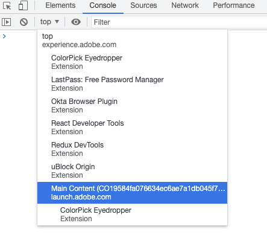

# JavaScript Reactor SDK

[](
https://travis-ci.com/adobe/reactor-sdk-javascript/settings)
[](
https://badge.fury.io/js/%40adobe%2Freactor-sdk)
[](
https://account.greenkeeper.io/account/adobe#repositories)

A Library for accessing the Adobe Experience Platform
[Launch API][Launch API doc].

This API is fairly low-level.  The Reactor methods are one-to-one with the
RESTful API endpoints, and they provide very little help in constructing your
payloads.  This is intended to meet the expectations of JavaScript developers,
but we welcome your feedback.

## Installation

### Using npm

You can use the Reactor SDK from npm with a bundler like
[Webpack](https://webpack.github.io/), [Rollup](https://rollupjs.org), or
[Parcel](https://parceljs.org/). If you use npm for client package management,
you can install the SDK with:

```bash
npm install @adobe/reactor-sdk
```

### Using a CDN

If you'd prefer not to use npm to manage your client packages, reactor-sdk
also provides a UMD distribution in a `dist` folder which is hosted on a CDN:

```html
<script src="https://unpkg.com/@adobe/reactor-sdk/dist/reactor-sdk.min.js"></script>
```

The Reactor constructor will be installed as `window.Reactor`, so typical usage
would go something like this:

```html
<script src="https://unpkg.com/@adobe/reactor-sdk/dist/reactor-sdk.min.js"></script>
<script>
  const tok = 'Your Access Token';
  const orgId = 'Your Org Id';
  const url = 'https://reactor.adobe.io';
  const reactor = new window.Reactor(tok, orgId, { reactorUrl: url });
  const acme = await reactor.getCompany('CO0123456789012345678901');
  ...
</script>
```

[How to retrieve your Access Token](#your-access-token).

[How to retrieve your Org ID](#your-org-id).

## Usage

The example below is a nodejs script that lists the ID's and names of all your
Company's properties.

Put this text in a file named `list-properties.js`:

```javascript
#!/usr/bin/env node
const Reactor = require('@adobe/reactor-sdk').default;

(async function() {
  const accessToken = process.env['ACCESS_TOKEN'];
  const orgId = process.env['ORG_ID'];
  const reactorUrl = 'https://reactor.adobe.io';
  const reactor = new Reactor(accessToken, orgId, { reactorUrl: reactorUrl });
  // Example API call: list Companies for the authenticated organization
  const companyList = await reactor.listCompanies();
  for (var company of companyList.data) {
    console.log(`${company.id} ${company.attributes.name}`);
    // Example API call: list Properties for the identified Company
    const list = await reactor.listPropertiesForCompany(company.id);
    for (var property of list.data) {
      console.log(`- ${property.id} ${property.attributes.name}`);
    }
  }
})();
```

You can optionally add custom headers that will be sent with each request as shown below.

``` javascript
const reactor = new window.Reactor(
  tok,
  orgId,
  {
    reactorUrl: url,
    customHeaders: {
      foo: "bar"
    }
  }
);
```

Run it...

```bash
export ACCESS_TOKEN=... # see instructions below
export ORG_ID=... # see instructions belor
chmod u+x ./list-properties.js
./list-properties.js
```

[How to retrieve your Access Token](#your-access-token).

[How to retrieve your Org ID](#your-org-id).

...and you should get output similar to:

```plain text
"COb711272b544e8359eab4492484893f77" "Fredigar and Bagginses"
"- PR090c7b576f892bf7a7f5e783d0e9ab75" "Shire Real Estate Holdings, LLC"
"- PR399e5b7dbcfc83db37051b43f5ac4d3b" "Mathom Recyclers, Ltd."
success
```

A browser implementation of this functionality would differ in two ways:

1. it would use the pre-initialized `window.Reactor` rather than
   `const Reactor = require('@adobe/reactor-sdk')`
2. providing your access token needs a different approach, since `process.env`
   is not available in browsers.
   Note: you _don't_ want to inline the text of your access token, unless you
   are sure no adversary will have access to your page.

## The SDK and the API

The Adobe Experience Platform Launch API is a RESTful
[`{json:api}`](https://jsonapi.org/)-compliant service.

Each Launch endpoint has a corresponding function in this library.  For example,
the ["Fetch a Profile"][FetchProfile doc] endpoint is accessed via the
[`getProfile()`][FetchProfile impl] SDK function.

Since the correspondence between API endpoints and SDK functions is one-to-one,
the [Launch API documentation][ListCompanies doc] is the primary source of
information.

(In addition to the live API documentation, the code that builds that
documentation is available under open source, at
[`reactor-developer-docs`][Launch API doc repo].  For example, the source code
of the ["Fetch a Profile"][FetchProfile doc] documentation is at
[profiles/fetch.md][FetchProfile doc src].)

[Launch API doc]: https://developer.adobelaunch.com/api/ 'Adobe Experience Platform Launch API'
[Launch API doc repo]: https://github.com/adobe/reactor-developer-docs 'Launch API documentation repository'
[FetchProfile doc]: https://developer.adobelaunch.com/api/reference/1.0/profiles/fetch/ 'Fetch a Profile'
[FetchProfile impl]: https://github.com/adobe/reactor-sdk-javascript/blob/master/src/profiles.js#L13
[FetchProfile doc src]: https://github.com/adobe/reactor-developer-docs/blob/master/api/reference/1.0/profiles/fetch.md 'Fetch a Profile'
[ListCompanies doc]: https://developer.adobelaunch.com/api/reference/1.0/companies/list/ 'List Companies'

Every SDK function [has an integration test](test/integration)
that demonstrates its correctness. (Well, correct for at least *one* use).
These tests also provide you working examples for every library function.  [This
isn't quite true yet.  We're almost there, but a few remain to be implemented.]

For a complete and self-contained example program, see
[examples.test.js](./test/integration/examples.test.js), which is included in
the integration tests. It's a JavaScript implementation of the [Reactor
Postman]( https://github.com/adobe/reactor-postman) query set.

## Developer Setup

If you want to contribute to development of this library,

```bash
git clone git@github.com:adobe/reactor-sdk-javascript.git
cd reactor-sdk-javascript
npm ci           # install dependencies and build Reactor SDK library
```

The clean install generates three versions of the library:

1. `./lib/node/*.js`, intended for use by nodejs projects
2. `./lib/browser/*.js`, intended for use by bundlers in browser projects
3. `./dist/reactor.min.js`, intended for loading directly into an HTML
    page (i.e., for non-bundled browser use)

With the SDK built, you can run its nodejs unit tests:

```bash
npm link "$(pwd)"           # make this SDK available to tests
npm run unit-tests          # run the tests in test/unit/**
```

The integration tests need a current access token, a provisioned Company, and your provisioned Org ID.
You are expected to provide them to the tests via the environment variables
`ACCESS_TOKEN`, `COMPANY_ID`, and `ORG_ID`.  Instructions for getting [your Access Token](#your-access-token),
[your Company Id](#your-company-id), and [your Org ID](#your-org-id) are given below.

The in-browser integration tests require a local static-file web server, because
loading their HTML using a `file://` URL is not effective: the browser
rejects all the resulting Reactor requests because they violate CORS
restrictions.  The necessary bare-bones web server is provided with this
project, as `scripts/static-server.js`.

Once you've collected the necessary values for your environment variables, you
can run the integration tests:

```bash
export ACCESS_TOKEN="your_reactor_access_token"
export COMPANY_ID="your_reactor_test_company_id" # "CO" followed by 32 hex digits
export ORG_ID="your_org_id" # 24 characters followed by "@AdobeOrg"
NODE_TLS_REJECT_UNAUTHORIZED=0 scripts/static-server.js --dir ./tmp.tests/
```

Switch to another terminal window, since you want that server to keep running.

```bash
npm run integration-tests   # run the tests in test/integration/**
# The library and bundled integration tests are currently not funcitoning,
# but node ones are. Getting them all running is in the backlog. - CR
```

[Update] As of 24 August 2021, current versions of Google Chrome _still_ won't
allow the files to be loaded, even with the static server. Apparently,
`localhost:5000` and `localhost:9010` are too different, and trigger CORS
blocking. On MacOS, I've been able to get the tests to work by shutting down
Chrome and relaunching with:

* Bundled Library Test

```bash
open -a "Google Chrome" ./tmp.tests/integration-bundled-sdk/integration-tests-bundled-sdk.html \
     --args --disable-web-security --user-data-dir="/tmp/chrome"
```

* Non-bundled Library Test

```bash
open -a "Google Chrome" ./tmp.tests/integration-library-sdk/integration-tests-library-sdk.html \
     --args --disable-web-security --user-data-dir="/tmp/chrome"
```


While developing the Reactor SDK, these are handy for auto-building when you
change the source code:

```bash
# re-run {lint, prettier, build} when src/**/*.js changes
npm run src-watch

# re-run {lint, prettier, build, and test} when {dist,test/unit}/**/*.js changes
npm run unit-watch

# re-run {lint, prettier, build, and test} when {dist,test/integration}/**/*.js changes
npm run integration-watch

# re-run {lint, prettier, build, and test} when {src,test}/**/*.js changes
npm run all-watch

# Periodically, you'll want to remove the Properties created during integration tests
scripts/delete-test-properties
```

## Determining Your Personal Information

### Your Access Token

* Using Google Chrome, log in to `https://launch.adobe.com/companies`
* Open the developer console
* Change the JavaScript context from "top" to "Main Content" using the dropdown menu
  
* Execute `copy(userData.imsAccessToken)`
* The access token is now in your system clipboard. Paste it into an
  environment variable definition:
  * `export ACCESS_TOKEN='<paste>'`

### Your Company ID

* Log in to `https://launch.adobe.com/companies`
* While looking at your Properties page, the address bar will show a URL like
  `https://launch.adobe.com/companies/CO81f8cb0aca3a4ab8927ee1798c0d4f8a/properties`.
* Your Company ID is the 'CO' followed by 32 hexadecimal digits (i.e., from "CO"
  up to the following slash). Copy that company ID to an environment variable:
  * `export COMPANY_ID=CO81f8cb0aca3a4ab8927ee1798c0d4f8a`

### Your Org ID

* Log into `https://launch.adobe.com/companies`
* Open the developer console
* Change the JavaScript context from "top" to "Main Content" using the dropdown menu
  
* Execute `copy(userData.profile.attributes.activeOrg)`
* The Org ID is now in your system clipboard. Paste it into an environment variable definition:
  * `export ACCESS_TOKEN='<paste>'`

## Future Work

* Implement integration tests for the handful of functions not yet covered.
* Include a section here on library function naming conventions.
* Find or implement a JavaScript library for handling JWT token generation. The
  current mechanism requires you to generate an access token yourself. Such
  tokens time out after while, forcing you to generate a new one.
* Describe how query parameters are passed in this SDK.

## Contributing

Contributions are welcomed! Read the [Contributing Guide](https://github.com/adobe/reactor-sdk-javascript/blob/master/CONTRIBUTING.md)
for more information.

Before submitting your PR

```bash
# commit your changes
$ git add .
$ git commit -m 'your commit message'
$ npm version {major|minor|patch}
$ git push
```
