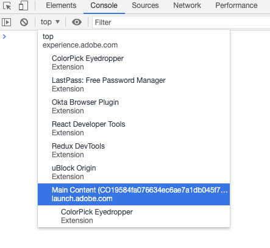

# JavaScript Reactor SDK

[](https://github.com/adobe/reactor-sdk-javascript/actions/workflows/dev.yaml)
[](https://badge.fury.io/js/%40adobe%2Freactor-sdk)
[](https://account.greenkeeper.io/account/adobe#repositories)

A Library for accessing the Adobe Experience Platform
[Reactor API][Reactor API doc].

This API is fairly low-level. The Reactor methods are one-to-one with the
RESTful API endpoints, and they provide very little help in constructing your
payloads. This is intended to meet the expectations of JavaScript developers,
but we welcome your feedback.

## Installation

### Using npm

You can use the Reactor SDK from npm with a bundler like
[Webpack](https://webpack.github.io/), [Rollup](https://rollupjs.org), or
[Parcel](https://parceljs.org/). If you use npm for client package management,
you can install the SDK with:

```bash
npm install @adobe/reactor-sdk
```

### Using a CDN

If you'd prefer not to use npm to manage your client packages, reactor-sdk
also provides a UMD distribution in a `dist` folder which is hosted on a CDN:

```html
<script src="https://unpkg.com/@adobe/reactor-sdk/dist/reactor-sdk.min.js"></script>
```

The Reactor constructor will be installed as `window.Reactor`, so typical usage
would go something like this:

```html
<script src="https://unpkg.com/@adobe/reactor-sdk/dist/reactor-sdk.min.js"></script>
<script>
  const tok = 'Your Access Token';
  const orgId = 'Your Org Id';
  const url = 'https://reactor.adobe.io';
  const reactor = new window.Reactor(tok, {
    reactorUrl: url,
    customHeaders: {'x-gw-ims-org-id': orgId}
  });
  const acme = await reactor.getCompany('CO0123456789012345678901');
  ...
</script>
```

[How to retrieve your Access Token](#your-access-token).

[How to retrieve your Org ID](#your-org-id).

## Usage

### Node.js Usage

The example below is a nodejs script that lists the ID's and names of all your
Company's properties.

Put this text in a file named `list-properties.js`:

```javascript
#!/usr/bin/env node
import Reactor from '@adobe/reactor-sdk';
// Or for CommonJS: const { default: Reactor } = require('@adobe/reactor-sdk').default;

(async function () {
  const accessToken = process.env['ACCESS_TOKEN'];
  const orgId = process.env['ORG_ID'];
  const reactorUrl = 'https://reactor.adobe.io';
  const reactor = new Reactor(accessToken, {
    reactorUrl: reactorUrl,
    customHeaders: { 'x-gw-ims-org-id': orgId }
  });
  // Example API call: list Companies for the authenticated organization
  const companyList = await reactor.listCompanies();
  for (var company of companyList.data) {
    console.log(`${company.id} ${company.attributes.name}`);
    // Example API call: list Properties for the identified Company
    const list = await reactor.listPropertiesForCompany(company.id);
    for (var property of list.data) {
      console.log(`- ${property.id} ${property.attributes.name}`);
    }
  }
})();
```

**Note:** If you are provisioned for multiple orgs, you will need to specify your org ID under `customHeaders` as shown below.

You can optionally add other custom headers that will be sent with each request by also
specifying them in the `customHeaders` object.

```javascript
const reactor = new window.Reactor(tok, {
  reactorUrl: url,
  customHeaders: {
    'x-gw-ims-org-id': orgId,
    'another-header-example': 42
  }
});
```

Run it...

```bash
export ACCESS_TOKEN=... # see instructions below
export ORG_ID=... # see instructions below
chmod u+x ./list-properties.js
./list-properties.js
```

...and you should get output similar to:

```plain text
"COb711272b544e8359eab4492484893f77" "Fredigar and Bagginses"
"- PR090c7b576f892bf7a7f5e783d0e9ab75" "Shire Real Estate Holdings, LLC"
"- PR399e5b7dbcfc83db37051b43f5ac4d3b" "Mathom Recyclers, Ltd."
success
```

### Browser Usage

A browser implementation of this functionality would differ in two ways:

1. it would use the pre-initialized `window.Reactor` rather than
   `import Reactor` or `require('@adobe/reactor-sdk').default`
2. providing your access token needs a different approach, since `process.env`
   is not available in browsers.
   Note: you _don't_ want to inline the text of your access token, unless you
   are sure no adversary will have access to your page.

## The SDK and the API

The Adobe Experience Platform Reactor API is a RESTful
[`{json:api}`](https://jsonapi.org/)-compliant service.

Each Reactor API endpoint has a corresponding function in this library. For example,
the ["Fetch a Profile"][FetchProfile doc] endpoint is accessed via the
[`getProfile()`][FetchProfile impl] SDK function.

Since the correspondence between API endpoints and SDK functions is one-to-one,
the [Reactor API documentation][ListCompanies doc] is the primary source of
information.

(In addition to the live API documentation, the code that builds that
documentation is available under open source, at
[`reactor-developer-docs`][Reactor API doc repo]. For example, the source code
of the ["Fetch a Profile"][FetchProfile doc] documentation is at
[profiles/fetch.md][FetchProfile doc src].)

[Reactor API doc]: https://developer.adobelaunch.com/api/ 'The Adobe Experience Platform Reactor API'
[Reactor API doc repo]: https://github.com/adobe/reactor-developer-docs 'Experience Platform Reactor API documentation repository'
[FetchProfile doc]: https://developer.adobelaunch.com/api/reference/1.0/profiles/fetch/ 'Fetch a Profile'
[FetchProfile impl]: https://github.com/adobe/reactor-sdk-javascript/blob/master/src/profiles.js#L13
[FetchProfile doc src]: https://github.com/adobe/reactor-developer-docs/blob/master/api/reference/1.0/profiles/fetch.md 'Fetch a Profile'
[ListCompanies doc]: https://developer.adobelaunch.com/api/reference/1.0/companies/list/ 'List Companies'

Every SDK function [has an integration test](test/integration)
that demonstrates its correctness. (Well, correct for at least _one_ use).
These tests also provide you working examples for every library function. [This
isn't quite true yet. We're almost there, but a few remain to be implemented.]

For a complete and self-contained example program, see
[test.spec.js](./examples/test.spec.js). This is also included in
the integration tests, see [examples.test.js](./test/integration/examples.test.js). It's
a JavaScript implementation of the [ReactorPostman](https://github.com/adobe/reactor-postman)
query set.

## Developer Setup

If you want to contribute to development of this library,

```bash
git clone git@github.com:adobe/reactor-sdk-javascript.git
cd reactor-sdk-javascript
npm ci           # install dependencies
npm run build:production    # build the Reactor SDK library
```

To get integration testing running, see [the integration testing setup instructions](./docs/INTEGRATION_TESTING.md).

The build process generates four versions of the library:

1. `./lib/node/*.js` - ES modules for Node.js projects
2. `./lib/cjs/*.cjs` - CommonJS modules for Node.js projects
3. `./lib/browser/*.js` - Individual transpiled files for bundlers in browser projects
4. `./dist/reactor-sdk.min.js` (15.84 kB) - Single bundled file for direct browser inclusion

With the SDK built, you can run its nodejs unit tests:

```bash
npm run test:unit          # run the tests in test/unit/**
```

The integration tests need a current access token, a provisioned Company, and your provisioned Org ID.
You are expected to provide them to the tests via the environment variables
`ACCESS_TOKEN`, `COMPANY_ID`, and `ORG_ID`. Instructions for getting [your Access Token](#your-access-token),
[your Company Id](#your-company-id), and [your Org ID](#your-org-id) are given below.

The in-browser integration tests require a local static-file web server, because
loading their HTML using a `file://` URL is not effective: the browser
rejects all the resulting Reactor requests because they violate CORS
restrictions. The integration test process automatically starts this server for you.

Once you've collected the necessary values for your environment variables, you
can run the integration tests:

```bash
export ACCESS_TOKEN="your_reactor_access_token"
export COMPANY_ID="your_reactor_test_company_id" # "CO" followed by 32 hex digits
export ORG_ID="your_org_id" # 24 characters followed by "@AdobeOrg"
npm run test:integration   # run the tests in test/integration/**
```

The integration test script will automatically:
- Start a local web server on port 5000
- Build the integration test files
- Run Node.js integration tests with Jasmine
- Open browser tests (unless in CI/headless mode)
- Clean up the server when done

[Update] As of 24 August 2021, current versions of Google Chrome _still_ won't
allow the files to be loaded, even with the static server. Apparently,
`localhost:5000` and `localhost:9010` are too different, and trigger CORS
blocking. On MacOS, I've been able to get the tests to work by shutting down
Chrome and relaunching with:

- Bundled Library Test

```bash
open -a "Google Chrome" ./tmp.tests/integration-bundled-sdk/integration-tests-bundled-sdk.html \
     --args --disable-web-security --user-data-dir="/tmp/chrome"
```

- Non-bundled Library Test

```bash
open -a "Google Chrome" ./tmp.tests/integration-library-sdk/integration-tests-library-sdk.html \
     --args --disable-web-security --user-data-dir="/tmp/chrome"
```

### Available Development Scripts

```bash
npm run build:production  # Build all library versions (ES modules, CommonJS, browser bundles)
npm run test              # Run full test suite (build + unit tests + integration tests)
npm run test:unit         # Run only unit tests
npm run test:integration  # Run only integration tests
npm run lint              # Fix linting issues in all JavaScript files
npm run lint:check        # Check for linting issues without fixing (useful for CI)
npm run clean             # Remove all build artifacts (dist/, lib/, tmp.tests/)
```

To clean up test properties created during integration testing:

```bash
node scripts/delete-test-properties.js
```

## Determining Your Personal Information

### Your Access Token

Here we provide instructions on two ways that you can retrieve your Access Token for use with the `reactor-sdk` project.

#### Programmatically via Adobe's [nodejs programmatic token](https://github.com/adobe/auth-token) project.

```javascript
#!/usr/bin/env node
// The @adobe/auth-token project also supports import syntax natively.
// here is a commonjs example.
const getAuthToken = (...args) =>
  import('@adobe/auth-token').then(({ auth: adobeAuth }) => adobeAuth(...args));
const Reactor = require('@adobe/reactor-sdk').default;

(async function () {
  // @adobe/auth-token config object: https://github.com/adobe/auth-token?tab=readme-ov-file#config-object
  const config = {
    clientId: 'YOUR_CLIENT_ID',
    clientSecret: 'YOUR_CLIENT_SECRET',
    scope: 'your,scopes,here' // https://developer.adobe.com/developer-console/docs/guides/authentication/UserAuthentication/implementation/#oauth-20-scopes
  };
  const tokenResponse = await getAuthToken(config);
  const accessToken = tokenResponse['access_token'];

  const orgId = process.env['ORG_ID'];
  const reactorUrl = 'https://reactor.adobe.io';
  const reactor = new Reactor(accessToken, {
    reactorUrl: reactorUrl,
    customHeaders: { 'x-gw-ims-org-id': orgId }
  });

  // perform API calls here
})();
```

#### Through the Adobe Tags user interface

- Using Google Chrome, log in to `https://launch.adobe.com/companies`
- Open the developer console
- Change the JavaScript context from "top" to "Main Content" using the dropdown menu
  
- Execute `copy(userData.imsAccessToken)`
- The access token is now in your system clipboard. Paste it into an
  environment variable definition:
  - `export ACCESS_TOKEN='<paste>'`

### Your Company ID

- Log in to `https://launch.adobe.com/companies`
- While looking at your Properties page, the address bar will show a URL like
  `https://launch.adobe.com/companies/CO81f8cb0aca3a4ab8927ee1798c0d4f8a/properties`.
- Your Company ID is the 'CO' followed by 32 hexadecimal digits (i.e., from "CO"
  up to the following slash). Copy that company ID to an environment variable:
  - `export COMPANY_ID=CO81f8cb0aca3a4ab8927ee1798c0d4f8a`

### Your Org ID

- Log into `https://launch.adobe.com/companies`
- Open the developer console
- Change the JavaScript context from "top" to "Main Content" using the dropdown menu
  
- Execute `copy(userData.profile.attributes.activeOrg)`
- The Org ID is now in your system clipboard. Paste it into an environment variable definition:
  - `export ORG_ID='<paste>'`

## Future Work

- Implement integration tests for the handful of functions not yet covered.
- Include a section here on library function naming conventions.
- Describe how query parameters are passed in this SDK.

## Contributing

Contributions are welcomed! Read the [Contributing Guide](https://github.com/adobe/reactor-sdk-javascript/blob/master/CONTRIBUTING.md)
for more information.

To get started:

1. Install [node.js](https://nodejs.org/).
1. Clone the repository.
1. After navigating into the project directory, install project dependencies by running `npm install`.
1. `cp .env-example .env` and modify the environment variables as needed.

Before submitting your PR

```bash
# commit your changes
$ git add .
$ git commit -m 'your commit message'
$ npm version {major|minor|patch}
$ git push
```
